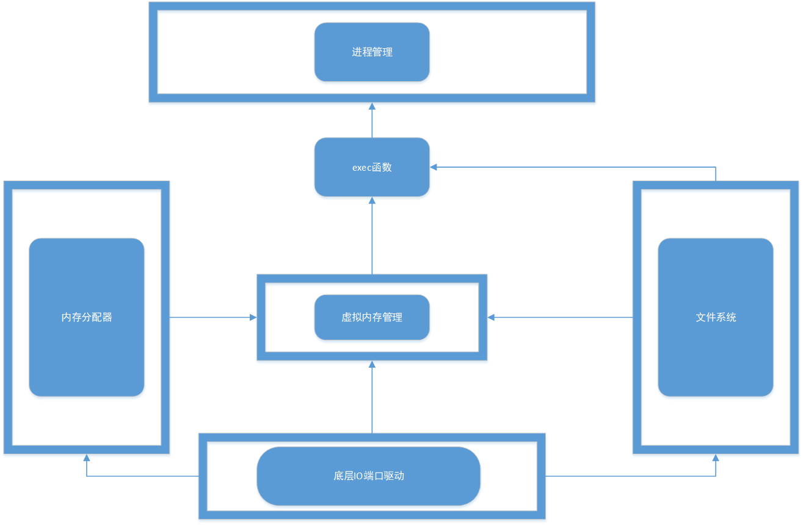

# xv6内存管理架构模型

* 底层驱动封装了部分硬件接口供上层系统调用

* 文件系统对外提供了些对文件的API操作

* 内存分配器完成对物理内存分配接口的封装，使上一层系统只需关注虚拟内存

* 虚拟内存系统提供了进程运行时所需的一系列接口

* exec函数通过调用虚拟内存管理系统及文件系统提供的接口完成进程运行的初始化，为进程管理提供服务

* 若将内存分配器，虚拟内存管理，exec函数看作整个内存管理系统的情况下

  xv6的内存管理架构采用了分层结构，exec函数调用虚拟内存管理系统提供的API，虚拟内存管理系统调用内存分配器提供的API