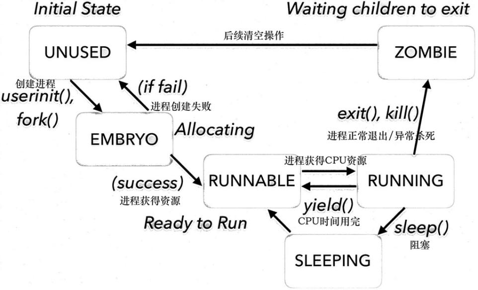
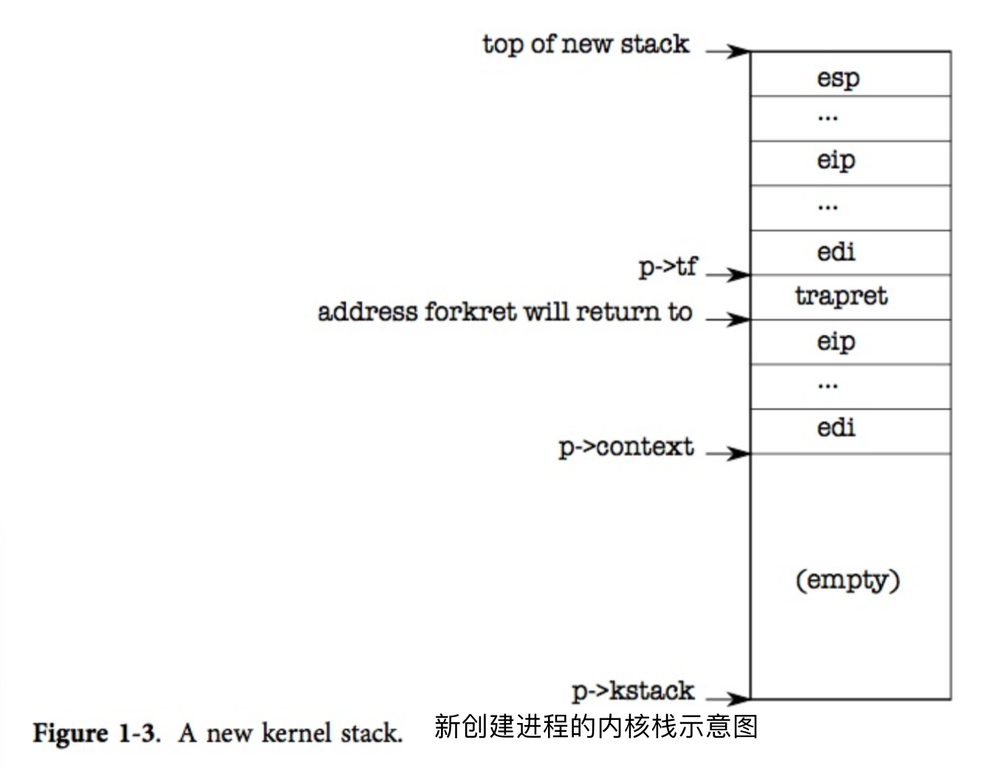
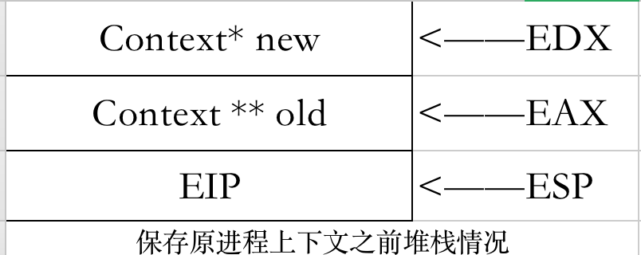
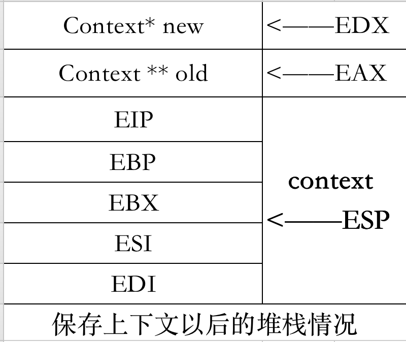
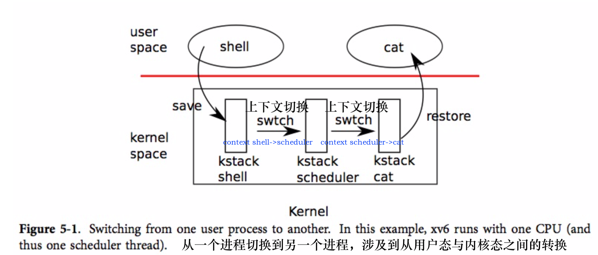

# XV6进程管理

`XV6`操作系统实现了一个基于进程 (**没有实现线程**) 的简单进程管理机制。

一个进程是一个具有一定独立功能的程序在一个数据集合上的一次动态执行过程，操作系统中资源分配的基本单位是进程，在引入了线程的操作系统中，线程是处理机调度的基本单位，而在`XV6 OS`中，进程是调度的基本单位。

`XV6`中进程和`CPU`的数据结构见`proc.h`


## 数据结构

在proc.h头文件中定义了与进程管理有关的数据结构procstate、context和proc


### 进程状态

为准确描述进程的状态，在proc.h中定义了procstate(State of process)枚举类型，描述XV6中进程的六种状态：EMBRO, SLEEPING, RUNNABLE, RUNNING和ZOMBIE六种状态，分别为未使用态、初始态、等待态、就绪态、运行态和僵尸态。

```c
/*枚举类型procstate,分别代表一个进程的六种状态 未分配、创建态、阻塞态、就绪态、运行态、结束态*/
enum procstate { UNUSED, EMBRYO, SLEEPING, RUNNABLE, RUNNING, ZOMBIE };
```

**进程状态简介**

* *UNUSED*：进程未被创建（PCB空闲）时的状态；
* *EMBRYO*：代表进程的创建态；
* *SLEEPING*：进程由于等待除处理机之外的资源，进入阻塞状态，即等待态/睡眠态/阻塞态；
* *RUNNABLE*：进程获得了除处理机之外的资源，等待分配处理机时间片，处于就绪态；
* *RUNNING*：进程获得处理机，正在执行进程，即运行态；
* *ZOMBIE*：进程执行完毕，即结束态。




<center><b>进程状态转换示意图</b></center>

**状态转换情况**

1. *UNUSED→EMBRYO*：执行一个程序，创建一个子进程。

2. *EMBRYO→RUNNABLE*：当操作系统完成了进程创建的必要操作，并且当前系统的性能和虚拟内存的容量均允许。

3. *RUNNING→ZOMBIE*：当一个进程到达了自然结束点，或是出现了无法克服的错误，或是被操作系统所终结，或是被其他有终止权的进程所终结。

4. *RUNNBALE→RUNNING*：当一个进程通过`Scheduler() `CPU调度获得CPU时间片，则进程进入RUNNING态开始执行进程程序段。

5. *RUNNING→SLEEPING*：当一个进程程序段执行过程中需要等待某资源或等待某一事件发生时，应当让出CPU资源，从而进入SLEEPING状态，等待事件的发生/资源的获得。

6. *SLEEPING→RUNNABLE*：当一个进程程序段等待的资源已经就绪或等待的某一事件发生时，应当进入CPU时间片等待队列，由SLEEPING态转为RUNNABLE态，等待CPU的调度 。


### 进程结构体

```c
struct proc {
  uint sz; // 进程的内存大小（以byte计）
  pde_t* pgdir; // 进程页路径的线性地址。
  char *kstack; // 进程的内核栈底
  enum procstate state; // 进程状态（包括六种UNUSED, EMBRYO, SLEEPING, RUNNABLE, RUNNING, ZOMBIE）
  int pid; // 进程ID
  struct proc *parent; // 父进程
  struct trapframe *tf; // 位于x86.h，是中断进程后，需要恢复进程继续执行所保存的寄存器内容。
  struct context *context; // 切换进程所需要保存的进程状态。切换进程需要维护的寄存器内容，定义在proc.h中。
  void *chan;  // 不为0时，是进程睡眠时所挂的睡眠队列
  int killed; // 当非0时，表示已结束
  struct file *ofile[NOFILE]; // 打开的文件列表
  struct inode *cwd; // 进程当前路径
  char name[16]; // 进程名称
};
```


### 进程上下文切换现场

```c
struct context {
  //变址寄存器
  //分别叫做"源/目标索引寄存器"
  //在很多字符串操作指令中, DS:ESI指向源串,而ES:EDI指向目标串.
  uint edi;
  uint esi;
  uint ebx;//基地址寄存器, 在内存寻址时存放基地址。
  uint ebp;//寄存器存放当前线程的栈底指针
  //寄存器存放下一个CPU指令存放的内存地址，当CPU执行完当前的指令后
  //从EIP寄存器中读取下一条指令的内存地址，然后继续执行。
  //EIP不会被显式设置，它在对swtch()函数的call和ret时被设置
  uint eip;
};
```

`struct context`实际上是五个寄存器的值，也就是在上下文切换时，主要做的事情就是保存并更新寄存器值。同时根据惯例，调用者会保存`%eax,%ecx,%edx`的值。xv6在进程调度中主要通过切换context上下文结构进行的，正常情况下c函数被调用时编译器会自动为其加上保存context的代码。


### CPU结构体

```c
 struct cpu {
    uchar apicid;                // Local APIC ID 每个cpu都有一个唯一硬件ID，这个ID可以lapicid()函数进行获取，然后存放于这个字段中。
    struct context *scheduler;   // scheduler context，即scheduler运行环境信息
    struct taskstate ts;         // Used by x86 to find stack for interrupt
    struct segdesc gdt[NSEGS];   // x86 global descriptor table
    volatile uint started;       // Has the CPU started?
    int ncli;                    // Depth of pushcli nesting.
    int intena;                  // Were interrupts enabled before pushcli?
    struct proc *proc;           // The process running on this cpu or null
  };
```

XV6操作系统可以运行在使用多核处理机的计算机上，在`proc.c`中使用 `struct cpu `来记录每一个CPU状态。


## 进程创建

###第一个进程`initproc`

```c
int main(void)
{
  //内存初始化，设备初始化，子系统初始化
  kinit1(end, P2V(4*1024*1024)); // phys page allocator 分配物理页面
  kvmalloc();      // kernel page table 内核页表分配
  mpinit();        // detect other processors 检测其他处理器
  lapicinit();     // interrupt controller initialization 中断控制器初始化
  seginit();       // segment descriptors initialization 段描述符号初始化
  picinit();       // disable pic initialization 停用图片
  ioapicinit();    // another interrupt controller initialization 另一个中断控制器初始化
  consoleinit();   // console hardware initialization 控制台硬件初始化
  uartinit();      // serial port initialization 串行端口初始化
  pinit();         // process table initialization 进程表初始化
  tvinit();        // trap vectors initialization 中断向量初始化
  binit();         // buffer cache initialization 缓冲区缓存初始化
  fileinit();      // file table initialization 文件表初始化
  ideinit();       // disk initialization 磁盘初始化
  startothers();   // start other processors 启动其他处理器
  kinit2(P2V(4*1024*1024), P2V(PHYSTOP)); // must come after startothers()
  //创建第一个进程（所有进程的父进程），完成CPU设置并调度进程
  userinit();      //完成初始化后,调用userinit()创建第一个进程
  mpmain();        // finish this processor's setup 完成此处理器的设置，开始调度进程
}
```

在`main.c`中的主函数，在完成了初始化一些设备和子系统后，它通过调用`userinit()`建立了第一个进程，以下着重分析第一个进程的创建过程，该进程是所有进程的父进程。

```c
//PAGEBREAK: 32
// Set up first user process.创建第一个用户进程
//这个函数只调用一次, 创建的init process是所有进程的父进程
/*
 init进程的内存布局：
 +--------------------+ 4GB
 |                    |
 |                    |
 |                    |
 +--------------------+ KERNBASE+PHYSTOP(2GB+224MB)
 |                    |
 |   direct mapped    |
 |   kernel memory    |
 |                    |
 +--------------------+
 |    Kernel Data     |
 +--------------------+ data
 |    Kernel Code     |
 +--------------------+ KERNLINK(2GB+1MB)
 |   I/O Space(1MB)   |
 +--------------------+ KERNBASE(2GB)
 |                    |
 |                    |
 |                    |
 |                    |
 |                    |
 |                    |
 |                    |
 |                    |
 +---------+----------+ PGSIZE <-- %esp
 |         v          |
 |       stack        |
 |                    |
 |                    |
 |     initcode.S     |
 +--------------------+ 0  <-- %eip
*/
void
userinit(void)
{
  struct proc *p;
  extern char _binary_initcode_start[], _binary_initcode_size[];//这是initcode.S的加载位置和大小

  /* 分配进程数据结构并初始化 */
  p = allocproc(); //在内存中分配一个proc结构，并初始化进程内核堆栈以及一系列内核寄存器
  
  initproc = p;   //将新分配内存的进程p赋值给initproc，代表所有进程的父进程
    /* 创建页表，将进程的kernel部分页映射进来 */
  if((p->pgdir = setupkvm()) == 0) //创建页表
    panic("userinit: out of memory?"); //若创建失败则可能内存不够，抛出异常
  /*将initcode.S第一个进程的代码加载到进程p中，并分配一页物理内存，将虚拟地址0映射到该物理地址，实现虚拟地址初始化*/
  inituvm(p->pgdir, _binary_initcode_start, (int)_binary_initcode_size);
  p->sz = PGSIZE; //设置进程大小为一页
  memset(p->tf, 0, sizeof(*p->tf));

    /* 设置初始的用户模式状态 */

  p->tf->cs = (SEG_UCODE << 3) | DPL_USER;//cs寄存器指向代码段并处于用户模式 
  p->tf->ds = (SEG_UDATA << 3) | DPL_USER;//ds寄存器指向数据段并处于用户模式 
  p->tf->es = p->tf->ds;
  p->tf->ss = p->tf->ds;
  p->tf->eflags = FL_IF;// 允许硬件中断 
  p->tf->esp = PGSIZE;// 用户栈大小为1页
  p->tf->eip = 0;  // beginning of initcode.S

  safestrcpy(p->name, "initcode", sizeof(p->name));
  p->cwd = namei("/");

  // this assignment to p->state lets other cores
  // run this process. the acquire forces the above
  // writes to be visible, and the lock is also needed
  // because the assignment might not be atomic.
  acquire(&ptable.lock);//获取进程锁，确保原子操作

  p->state = RUNNABLE;  //将进程状态置RUNNABLE

  release(&ptable.lock);//释放进程锁
}
```

`userinit()`函数通过调用`allocproc()`函数在`ptable`中找到一个闲置`PCB(即proc)`，然后初始化该进程的内核栈。内存大小是有限的，因而进程的个数也是有限的，`allocproc()`函数的作用是从`ptable`进程表中寻找到一个空闲的`PCB`，若找到则将进程状态从`UNUSED`置为`EMBRYO`，为其分配`pid`并释放进程表锁，防止死锁或长时间等待；然后分配内核栈，设置进程上下文使新进程从`forkret`开始执行，并返回到中断管理`trapret`，然后返回这个结构体的指针。

***在这个寻找与分配的过程中如果没有空闲的`PCB`可以使用，或者分配内核栈失败，则返回0代表没有分配`proc`结构体失败。***

```c
//PAGEBREAK: 32
// Look in the process table for an UNUSED proc.
// If found, change state to EMBRYO and initialize
// state required to run in the kernel.
// Otherwise return 0.
static struct proc*
allocproc(void)
{
  struct proc *p;
  char *sp;

  acquire(&ptable.lock);//获取进程表锁 

  for(p = ptable.proc; p < &ptable.proc[NPROC]; p++)
    if(p->state == UNUSED) //寻找未使用的进程控制块
      goto found;

  release(&ptable.lock); //未找到，释放进程锁
  return 0; //返回0

found:
  p->state = EMBRYO; //设置进程状态为创建态
  p->pid = nextpid++; //设置进程ID（自增）

  release(&ptable.lock); //释放进程锁

  // Allocate kernel stack.
  if((p->kstack = kalloc()) == 0){ //从内存链表上分配4096字节的一页内存作为内核栈空间 
    p->state = UNUSED; //分配失败，重置进程状态
    return 0; //返回0，进程内存分配失败
  }
  sp = p->kstack + KSTACKSIZE; //将栈顶指针设置为内存高地址处 

  // Leave room for trap frame.
  sp -= sizeof *p->tf;
  p->tf = (struct trapframe*)sp; //设置trapframe的栈底指针 

  // Set up new context to start executing at forkret,
  // which returns to trapret.
  sp -= 4;
  *(uint*)sp = (uint)trapret;
  sp -= sizeof *p->context;
  p->context = (struct context*)sp; //设置进程上下文指针 
  memset(p->context, 0, sizeof *p->context);
  p->context->eip = (uint)forkret; //init进程将从forkret处开始执行 
  return p;
}

```

分配完进程槽以后，需要创建进程的页表，设置进程的若干属性：进程空间，打开中断等，并加载第一个进程的程序`initcode.S`。

```c
    /* 创建页表，将进程的kernel部分页映射进来 */
  if((p->pgdir = setupkvm()) == 0) //创建页表
    panic("userinit: out of memory?"); //若创建失败则可能内存不够，抛出异常
  /*将initcode.S第一个进程的代码加载到进程p中，并分配一页物理内存，将虚拟地址0映射到该物理地址，实现虚拟地址初始化*/
  inituvm(p->pgdir, _binary_initcode_start, (int)_binary_initcode_size);
  p->sz = PGSIZE; //设置进程大小为一页
  memset(p->tf, 0, sizeof(*p->tf));

    /* 设置初始的用户模式状态 */

  p->tf->cs = (SEG_UCODE << 3) | DPL_USER;//cs寄存器指向代码段并处于用户模式 
  p->tf->ds = (SEG_UDATA << 3) | DPL_USER;//ds寄存器指向数据段并处于用户模式 
  p->tf->es = p->tf->ds;
  p->tf->ss = p->tf->ds;
  p->tf->eflags = FL_IF;// 允许硬件中断 
  p->tf->esp = PGSIZE;// 用户栈大小为1页
  p->tf->eip = 0;  // beginning of initcode.S

  safestrcpy(p->name, "initcode", sizeof(p->name));
  p->cwd = namei("/");
```

这里我们特别关注一下新的可执行程序`initcode.S`是如何执行的，实际上在`XV6 OS`中是通过修改`trapframe`的`%eip`为新程序的起点即可，`  p->tf->eip = 0;  // beginning of initcode.S`。

```c
# Initial process execs /init.
# This code runs in user space.

#include "syscall.h"
#include "traps.h"

#第一个进程运行程序的汇编代码
# exec(init, argv)
# 触发 exec 系统调用
#将 argv，init，0三个值压入栈
.globl start
start:
  pushl $argv
  pushl $init
  pushl $0  // where caller pc would be
  movl $SYS_exec, %eax #将系统调用编号存放在%eax寄存器中
  int $T_SYSCALL  # 调用编号为T_SYSCALL即64号中断进入系统调用

# for(;;) exit(); 
exit:
  movl $SYS_exit, %eax
  int $T_SYSCALL
  jmp exit

# char init[] = "/init\0";
init:
  .string "/init\0"

# char *argv[] = { init, 0 };
.p2align 2
argv:
  .long init
  .long 0
```

`initcode`的作用实际上就是通过系统调用`exec`执行`/init`程序。

完成初始化工作后，`userinit`函数将进程的状态设置为就绪态`RUNNABLE`。

```c
p->state = RUNNABLE;  //将进程状态置RUNNABLE
```

***第一个进程的内核栈示意图如下：***



`XV6 OS`可以运行于多处理机环境(上限为8个`CPU`)，每一个处理机都需要完成上述相应的初始化，最后调用`scheduler()`开始进程的调度，`scheduler()`作为当前`CPU`的内核调度器线程，循环从`ptable`中寻找已就绪的进程运行在当前`CPU`上。具体的调度方式参见下文的***进程调度***篇章。


### 创建子进程`fork()`

除了第一个进程之外，其他进程（子进程）都是由父进程`initproc`创建的。即父进程调用`fork()`函数。过程如下：

1. 获取当前的进程，其过程为在调用`myproc`函数中调用`mycpu`来表示当前的cpu。
2. 调用`allocproc`初始化该proc。
3. 以一次一页的方式复制父进程地址空间，若失败则回收空间并报报错。
4. 子进程继承父进程的大小，设置父进程为当前进程，继承`trapframe`。
5. 设置`trapframe`的`%eax`为0，这样通过中断返回的时候，会返回0。
6. 子进程继承父进程的打开的文件和当前工作目录，以及父进程的名字
7. 设置进程当前状态为就绪`RUNNABLE`
8. 最后返回子进程的`pid`

```c
// Create a new process copying p as the parent.
// Sets up stack to return as if from system call.
// Caller must set state of returned proc to RUNNABLE.
int
fork(void)
{
  int i, pid;
  struct proc *np;
  struct proc *curproc = myproc(); //获取当前进程curproc

  // Allocate process.
  if((np = allocproc()) == 0){ //分配proc结构体，初始化该proc
    return -1;
  }

  // Copy process state from proc.
  if((np->pgdir = copyuvm(curproc->pgdir, curproc->sz)) == 0){ //一次一页复制父进程地址空间
    kfree(np->kstack);
    np->kstack = 0;
    np->state = UNUSED; //复制失败，回收空间
    return -1;
  }
  np->sz = curproc->sz; //继承父进程大小
  np->parent = curproc; //设置父进程为curproc
  *np->tf = *curproc->tf; //继承trapframe

  // Clear %eax so that fork returns 0 in the child.
  np->tf->eax = 0; //清除寄存器%eax内容，中断返回0

  for(i = 0; i < NOFILE; i++)
    if(curproc->ofile[i])
      np->ofile[i] = filedup(curproc->ofile[i]); //继承打开文件
  np->cwd = idup(curproc->cwd);  //继承运行目录

  safestrcpy(np->name, curproc->name, sizeof(curproc->name)); //继承父进程名
 
  pid = np->pid;

  acquire(&ptable.lock); //获取进程表锁

  np->state = RUNNABLE; //置进程状态为就绪态

  release(&ptable.lock);

  return pid; //返回新进程pid
}
```

### 进程创建学习总结

`XV6 OS`中，主要通过第一个进程的创建过程（在`main.c`中完成设备与子系统初始化以后调用`userinit()`创建所有进程的父进程），之后的各进程则通过`fork()`创建子进程。子进程与父进程将执行相同的程序文本段，但是各自拥有不同的栈段、数据段和堆栈数据拷贝。

在进程创建的学习过程中，涉及到了大量的内存堆栈与汇编语言的知识，在理解过程中存在一定的困难，在教学周的操作系统课程上对于进程创建仅停留在一个最基本、概括的创建过程"申请`PCB`->分配资源->初始化`PCB`->将新进程插入队列"，而在`XV6`中，通过具体操作系统的研习，对于其中的底层原理有了更深刻的理解，收获颇丰。


## 进程切换`swtch()`

### 基本概念

操作系统为了控制进程的执行，提高系统资源的利用率，必须有能力挂起正在CPU上运行的进程，并恢复以前挂起的某个进程的执行，这种行为被称为进程切换，任务切换或上下文切换。进行进程切换就是从正在运行的进程中收回处理器，然后再使待运行进程来占用处理器。 


### `swtch()`实现方式

在VX6中，通过`swtch()`函数来实现进程之间的切换。在该操作系统中，进程切换的过程实际上可分为以下几步

* 将当前`CPU`执行进程的寄存器的内容`%eip,%epb,%ebx,%esi,%edi`保存在栈上
* 创建一个新的`struct context`进程上下文结构体，保存当前进程寄存器的值(实际上就是刚刚压入栈中的五个寄存器)
* 将原进程的`context`上下文环境栈顶地址保存，压入进程栈中
* 切换堆栈环境(实则是切换了进程)
* 将寄存器内容`%eip,%epb,%ebx,%esi,%edi`（即新进程的上下文环境）退出栈，实现进程上下文的恢复

至此，通过上述几步，完成进程的切换。

在VX6的源代码中，swtch()函数是通过汇编代码的形式给出的，源码位于swtch.S文件中。


###`swtch.S`代码分析

```
# Context switch
#   进程切换函数汇编代码
#   void swtch(struct context **old, struct context *new);
#   函数原型void swtch(struct context **old, struct context *new);
# Save the current registers on the stack, creating
# a struct context, and save its address in *old.
# Switch stacks to new and pop previously-saved registers.

.globl swtch
swtch: #寄存器参数赋值
  # 进程堆栈如下：
  #          +----------------+
  #          | context *new   |
  #  edx --> +----------------+
  #          | context **old  |
  #  eax --> +----------------+
  #          | eip            |
  #  esp --> +----------------+
  movl 4(%esp), %eax #将Reg[4+esp]的内容赋值给Reg[eax]
  movl 8(%esp), %edx #将Reg[8+esp]的内容赋值给Reg[edx]

  # Save old callee-saved registers
  #            +----------------+
  #            | context *new   |
  #  edx -->   +----------------+
  #            | context **old  |
  #  eax -->   +----------------+
  #          / | eip            |
  #          | +----------------+
  #          | | ebp            |
  #          | +----------------+
  #  context | | ebx            |
  #          | +----------------+
  #          | | esi            |
  #          | +----------------+
  #          \ | edi            |
  #  esp -->   +----------------+
  pushl %ebp #保存存放当前线程的栈底指针的寄存器，压入栈中
  pushl %ebx #保存基地址寄存器，压入栈中
  pushl %esi #保存源索引寄存器，压入栈中
  pushl %edi #保存目标索引寄存器，压入栈中

  # Switch stacks 切换堆栈环境
  movl %esp, (%eax)   #将Reg[esp]的内容赋值给Reg[eax]，保存原进程栈顶指针至eax寄存器，*old = old_proc->context = esp
  movl %edx, %esp     #将Reg[edx]的内容赋值给Reg[esp]，即建立新的进程栈环境，esp = new_proc->context

  # Load new callee-saved registers 恢复上下文环境
  popl %edi  #弹出新进程context上下文的寄存器内容，恢复。
  popl %esi
  popl %ebx
  popl %ebp
  ret #返回函数调用点
```

1. 函数原型`void swtch(struct context **old, struct context *new)`

   在swtch.S中通过汇编语言的方式定义了swtch函数，第一参数为进程切换前占有CPU的进程上下文地址指针，第二参数为进程切换后占有CPU的进程上下文地址指针

   ***调用示例***

   ```c
   void
   scheduler(void)
   {
     struct proc *p;
     struct cpu *c = mycpu();
     c->proc = 0;
     for(;;){
       sti();
       acquire(&ptable.lock);
       for(p = ptable.proc; p < &ptable.proc[NPROC]; p++){
         if(p->state != RUNNABLE)
           continue;
         c->proc = p; 												//找到处于就绪态RUNNABLE的进程p
         switchuvm(p);
         p->state = RUNNING;
         //切换进程,调用swtch函数,第一参数为&(c->scheduler),为原进程的上下文环境
         //第二参数为p->context,为欲调度进程的上下文环境
         swtch(&(c->scheduler), p->context); 
         switchkvm();
         c->proc = 0;
       }
       release(&ptable.lock);
     }
   }
   ```

2. 汇编代码分析



`%eax`寄存器所存储的是原进程的上下文堆栈地址，`%edx`寄存器所存储的是切换后进程的上下文堆栈地址，因此调用`swtch()`函数以后，首先需要给`%edx、%eax`寄存器赋值

```c
  //swtch()汇编代码部分:寄存器参数赋值
	movl 4(%esp), %eax #将Reg[4+esp]的内容赋值给Reg[eax]
  movl 8(%esp), %edx #将Reg[8+esp]的内容赋值给Reg[edx]
```

调用`swtch()`以后，会自动将调用指令的下一条指令地址即`EIP`压入栈中，以便`swtch()`执行完毕以后能够返回到函数调用点。

在切换到目标进程之前，需要保存原进程的`context`上下文环境(即五个寄存器的值，由于这里`EIP`已经在调用时保存，所以只要依次保存四个寄存器即可)，以便再次切换到该进程可以继续执行该进程。

```c
  //swtch()汇编代码部分:保存原进程上下文环境
  pushl %ebp #保存存放当前线程的栈底指针的寄存器，压入栈中
  pushl %ebx #保存基地址寄存器，压入栈中
  pushl %esi #保存源索引寄存器，压入栈中
  pushl %edi #保存目标索引寄存器，压入栈中
```



完成上下文环境寄存器的保存以后，堆栈情况如图。最后五个寄存器正好构成了原进程的`context`，`%esp`即指向原进程的上下文堆栈地址。

之后，需要进行进程上下文环境的切换，将`%esp`的地址保存至`%eax`中，便于恢复进程时能够恢复进程的上下文环境；同时，将当前的栈顶地址切换为新进程的栈顶地址。这通过以下汇编代码实现：

```c
  # Switch stacks 切换堆栈环境
  movl %esp, (%eax)   #将Reg[esp]的内容赋值给Reg[eax]，保存原进程栈顶指针至eax寄存器
  movl %edx, %esp     #将Reg[edx]的内容赋值给Reg[esp]，即建立新的进程栈环境
```

这样，就完成了进程堆栈的切换，但是现在进程的上下文环境还没有恢复，还需要从堆栈中弹出寄存器的内容，才能完全实现上下文环境的恢复，完成进程的切换。

```c
  # Load new callee-saved registers 恢复上下文环境
  popl %edi  #弹出新进程context上下文的寄存器内容，恢复。
  popl %esi
  popl %ebx
  popl %ebp
```

至此，整个进程切换的过程就完成了，最后只需要返回`swtch()`函数的调用点，执行下一条指令即可。

```c
  ret #返回函数调用点
```


###进程切换学习总结

- 为了控制进程的执行，内核必须有能力挂起正在`CPU`上执行的进程，并恢复以前挂起的某个进程的执行，这叫做进程切换、任务切换、上下文切换；

- 挂起正在`CPU`上执行的进程，与中断时保存现场是不同的，中断前后是在同一个进程上下文中，只是由用户态转向内核态执行；

- 进程上下文包含了进程执行需要的所有信息

  ```
      用户地址空间：包括程序代码，数据，用户堆栈等
      控制信息：进程描述符，内核堆栈等
      硬件上下文（注意中断也要保存硬件上下文只是保存的方法不同）
  ```

在`XV6 OS`中，模拟了一个进程上下文`context`结构体，其中只有五个寄存器的值`%eip,%epb,%ebx,%esi,%edi`，与实际的大型操作系统如`Linux`仍然有很大的区别，但是通过对于进程切换的源码分析与研究，对于汇编语言知识、以及操作系统中维护的内核堆栈与寄存器等内容有了更加深刻的理解。


## 进程调度

### 基本概念

无论是在批处理系统还是分时系统中，用户进程数一般都多于处理机数、这将导致它们互相争夺处理机。另外，系统进程也同样需要使用处理机。这就要求进程调度程序按一定的策略，动态地把处理机分配给处于就绪队列中的某一个进程,以使之执行。 


###原理分析

`XV6 OS`中，进程调度分为两个部分：进程调出`sched()`和进程调入`scheduler()`。

进程调出是指，当一个进程异常中断、时间片用完、睡眠等情况下需要剥夺或者让出该进程的处理机资源，主要在`sched()`中实现。

进程调入是指，在`scheduler()`函数（*CPU*的内核调度器线程）中，*CPU*不断从`ptable`页表中寻找**可调度**的进程（即:进程状态处于*RUNNABLE*的进程），并且赋予其处理机资源，投入运行。

进程调度实则就是一个从原进程剥夺处理机（调出进程），找到可以运行的进程（调入进程），切换内核栈，完成上下文环境的切换(`old context->new context`)，然后赋予新进程处理机资源的过程。

`XV6 OS`不会直接从一个进程的上下文切换到另一个进程的上下文，而是通过一个中间的内核线程实现的:内核调度器线程，其中调用`swtch(struct context **old, struct context *new)`完成上下文切换。具体如图：



`XV6 OS`中，在`main.c`中经过一系列初始化之后，内核会进入`scheduler`中，开始第一次进程调度。首先内核会允许中断，然后加锁，在循环体中找到一个就绪状态的进程。然后调用`switchuvm()`切换到该进程的页表。然后使用`swtch()`切换到该进程中运行，该函数会按照`struct proc`中保存的上下文去切换上下文。然后再切回内核的页表最后再释放锁。

在进程运行的过程中，时钟会发送一个中断的信号给内核，强制结束进程只能在某时间片上运行(时间片轮转)，若一个进程的时间片用完，操作系统则调用`trap`函数调用`yield`函数，`yield`调用`sched()`陷入内核态，调用内核的`scheduler()`调度器，切换上下文环境实现进程调度。除此之外，进程异常中断、睡眠、正常退出等都会引发进程的调度，具体请见下文详述。


#### 进程调入`scheduler()`分析

`XV6 OS`中，由***进程创建***分析部分中可见，在操作系统的主函数中，需要完成第一个进程的创建（所有进程的父进程）。

```c
//创建第一个进程（所有进程的父进程），完成CPU设置并调度进程
  userinit();      //完成初始化后,调用userinit()创建第一个进程
  mpmain();        // finish this processor's setup 完成此处理器的设置，开始调度进程
```

其中，`mpmain()`函数的定义如下

```c
// Common CPU setup code.
static void
mpmain(void)
{
  //完成CPU的配置，输出参数，通知其他处理机（若为多核处理机）本处理机初始化完毕
  cprintf("cpu%d: starting %d\n", cpuid(), cpuid());
  idtinit();       // load idt register
  xchg(&(mycpu()->started), 1); // tell startothers() we're up
  scheduler();     // start running processes 调用schedluer()函数，开始无限循环寻找RUNNABLE状态的进程赋予其处理机资源
}
```

`XV6 OS`可以运行于多处理机环境(上限为8个`CPU`)，每一个处理机都需要完成相应的初始化，并调用`scheduler()`开始进程的调度，`scheduler()`作为当前`CPU`的内核调度器线程，循环从`ptable`中寻找已就绪的进程运行在当前`CPU`上。

```c
//void scheduler(void)源码分析
//PAGEBREAK: 42
// Per-CPU process scheduler.
// Each CPU calls scheduler() after setting itself up.
// Scheduler never returns.  It loops, doing:
//  - choose a process to run
//  - swtch to start running that process
//  - eventually that process transfers control
//      via swtch back to the scheduler.
void scheduler(void)
{
  struct proc *p;
  struct cpu *c = mycpu(); //获取当前CPU
  c->proc = 0;
  for(;;){
    // Enable interrupts on this processor.
    sti(); // 在每次执行一个进程之前，需要调用sti()函数开启CPU的中断
    // Loop over process table looking for process to run.
    acquire(&ptable.lock);  //获取进程表锁，与其他CPU的scheduler线程互斥
    for(p = ptable.proc; p < &ptable.proc[NPROC]; p++){
      if(p->state != RUNNABLE) //扫描进程表, 找到一个进程状态为RUNNABLE的进程
        continue;
      // Switch to chosen process.  It is the process's job
      // to release ptable.lock and then reacquire it
      // before jumping back to us.
       /*切换到选择的进程，释放进程表锁，当进程结束时，再重新获取*/
      c->proc = p; //将找到的进程设置为CPU当前执行的进程
      switchuvm(p); //切换至目标进程页表，并通知硬件
      p->state = RUNNING; //切换进程状态为RUNNING，将进程p置为运行态
      /* 
       * this perform a context switch to the target process's kernel thread
       * the current context is not a process but rather a special per-cpu scheduler context,
       * so scheduler tells swtch() to save the current hardware registers in 
       * per-cpu storage(cpu->scheduler) rather than in any process's kernel thread context
       */ 
      swtch(&(c->scheduler), p->context);//从当前cpu->scheduler现场切换至进程p的上下文环境
      switchkvm();//切换至内核页表
      // Process is done running for now.
      // It should have changed its p->state before coming back.
      //当前cpu没有正在运行的进程
      c->proc = 0;
    }
    release(&ptable.lock); //释放进程锁
  }
}
```

* 需要注意的是，在`XV6`的`scheduler()`中每一次循环之前都会执行`acquire(&ptable.lock)`以获取进程表锁，与其他`CPU`的`scheduler`线程互斥，每一次循环之后都必须释放进程锁`release(&ptable.lock)`，这是为了防止`CPU`闲置时，由于当前`CPU`一直占有锁，其他`CPU`无法调度运行导致的死锁；同时总是要在调度时打开中断`sti()`，这是为了防止当所有进程都在等待`I/O`时，由于关闭中断而产生的死锁问题。

* 在切换进程上下文之前与进程结束之后，都要分别切换至目标页表`switchuvm(p)`与内核页表`switchkvm()`。进程切换切换的是进程页表(即将新进程的pgd(页目录)加载到CR3寄存器中)，而内核页表是所有进程共享的，每个进程的“进程页表”中内核态地址相关的页表项都是“内核页表”的一个拷贝。

* 进程的调度实则是三个上下文环境之间的切换：`old process context, kernel context, new process context`，在调出和调入之间，需要kernel进行调度工作。


#### 进程调出分析

进程的调度包含进程调出过程，也就是从用户态进程进入内核，如进程`sleep(), exit()`或者中断，调出主要在`sched()`中进行，它是进程从用户态进入内核态的入口。与直接调用`scheduler()`不同的是，`sched()`中对于进程上下文切换的条件进行了判断，确保进程释放`CPU`资源前已经获取了进程表锁、执行过了`pushcli`，原进程处于非***RUNNING***状态，以及`CPU`处于不可中断状态；所有条件满足以后才会进入内核态，将上下文切换至`cpu`的`scheduler`，否则即抛出异常。

```c
//判断是否满足陷入内核态的各条件，进入内核态
void sched(void)
{
  int intena;
  struct proc *p = myproc();
  if(!holding(&ptable.lock))   // 是否获取到了进程表锁
    panic("sched ptable.lock");
  if(mycpu()->ncli != 1)   // 是否执行过pushcli
    panic("sched locks");
  if(p->state == RUNNING)  // 执行的程序应该处于结束或者睡眠状态
    panic("sched running");
  if(readeflags()&FL_IF)  // 判断中断是否可以关闭
    panic("sched interruptible");
  intena = mycpu()->intena;
  swtch(&p->context, mycpu()->scheduler);    // 上下文切换至当前cpu的scheduler
  mycpu()->intena = intena;
}
```


#####时间片用完`yield()`

如果一个进程属于时间片用完的状态，需要进行调度，则调用`yield()`函数，让出一个`cpu`调度时间片。

```c
// Give up the CPU for one scheduling round.
void
yield(void)
{
  acquire(&ptable.lock);  //DOC: yieldlock 获取进程表锁
  myproc()->state = RUNNABLE; //当前进程时间片用完，置就绪状态
  sched();  //请求调度
  release(&ptable.lock); //释放进程表锁
}
```


##### 进程等待（等待子进程退出）`wait()`

当前进程需要等待子进程退出时，会调用`wait()`函数，从而引发进程的调度。

`wait()`函数的工作流程如下：

1. 用`myproc()`获取当前进程，加锁后进入无限循环
2. 查找当前进程的子进程
3. 如果没有或者当前进程被杀死了返回-1
4. 否则判断子进程是否处于僵尸状态，若是则设置其为`UNUSED`，并且重置该进程上所有的内容，包括释放栈空间等。
5. 返回该子进程的pid

```c
// Wait for a child process to exit and return its pid.
// Return -1 if this process has no children.
int
wait(void)
{
  struct proc *p;
  int havekids, pid;
  struct proc *curproc = myproc(); //获取当前进程
  
  acquire(&ptable.lock); //进程表加锁
  for(;;){ //无限循环，寻找当前进程的子进程
    // Scan through table looking for exited children.
    havekids = 0;
    for(p = ptable.proc; p < &ptable.proc[NPROC]; p++){
      if(p->parent != curproc)
        continue;
      havekids = 1;
      if(p->state == ZOMBIE){
        // Found one.
        //重置该进程上所有的内容，释放堆栈，置进程状态为UNUSED
        pid = p->pid;
        kfree(p->kstack);
        p->kstack = 0;
        freevm(p->pgdir);
        p->pid = 0;
        p->parent = 0;
        p->name[0] = 0;
        p->killed = 0;
        p->state = UNUSED;
        release(&ptable.lock);
        return pid;
      }
    }

    // No point waiting if we don't have any children.
    if(!havekids || curproc->killed){ //没有子进程或者当前进程被杀死了返回-1
      release(&ptable.lock); //释放进程表锁
      return -1;
    }

    // Wait for children to exit.  (See wakeup1 call in proc_exit.)
    sleep(curproc, &ptable.lock);  //DOC: wait-sleep 等待子进程退出
  }
}
```

调用`sleep()`置睡眠态，进入内核态调度进程。

```c
// Atomically release lock and sleep on chan.
// Reacquires lock when awakened.
void
sleep(void *chan, struct spinlock *lk)
{
  struct proc *p = myproc(); //获取当前进程
  
  if(p == 0)
    panic("sleep");

  if(lk == 0)
    panic("sleep without lk");

  // Must acquire ptable.lock in order to
  // change p->state and then call sched.
  // Once we hold ptable.lock, we can be
  // guaranteed that we won't miss any wakeup
  // (wakeup runs with ptable.lock locked),
  // so it's okay to release lk.
  if(lk != &ptable.lock){  //DOC: sleeplock0
    acquire(&ptable.lock);  //DOC: sleeplock1
    release(lk);
  }
  // Go to sleep.
  p->chan = chan;
  p->state = SLEEPING; //置进程状态为SLEEPING

  sched();	//调度进程，陷入内核态

  // Tidy up.
  p->chan = 0; //释放进程等待链

  // Reacquire original lock.
  if(lk != &ptable.lock){  //DOC: sleeplock2
    release(&ptable.lock);
    acquire(lk);
  }
}

```


##### 进程退出`exit()`

进程正常退出时，也会引发进程的调度，在`exit()`函数中调用`sched()`陷入内核态完成进程调度。

`exit()`进程终止函数工作流程如下：

1. 用`myproc()`获取当前进程，检查是否是初始进程，若是则对控制台输出`init exiting`再调用exit()自身。

然后关闭所有文件。

2. 调用`iput`函数把对当前目录的引用从内存中删除。

3. 上锁后唤醒当前进程的父进程，以及以上的进程。

4. 把当前进程的所有子进程都划归为用户初始进程`initproc`的子进程中。

5. 把当前进程改为僵尸进程，调用`sched()`陷入内核态使用进程调度器调度下一个可执行进程。

```c
// Exit the current process.  Does not return.
// An exited process remains in the zombie state
// until its parent calls wait() to find out it exited.
void
exit(void)
{
  struct proc *curproc = myproc(); //获取当前进程
  struct proc *p;
  int fd;

  if(curproc == initproc)
    panic("init exiting");

  // Close all open files.
  for(fd = 0; fd < NOFILE; fd++){ //关闭当前进程打开的所有文件
    if(curproc->ofile[fd]){
      fileclose(curproc->ofile[fd]);
      curproc->ofile[fd] = 0;
    }
  }

  begin_op();
  iput(curproc->cwd);		//把对当前目录的引用从内存中删除
  end_op();
  curproc->cwd = 0;			//当前运行目录置空

  acquire(&ptable.lock);	//获取进程表锁

  // Parent might be sleeping in wait().
  wakeup1(curproc->parent); //唤醒当前进程的父进程，以及以上的进程

  // Pass abandoned children to init.
  //把当前进程的所有子进程都划归为用户初始进程initproc的子进程中。
  for(p = ptable.proc; p < &ptable.proc[NPROC]; p++){
    if(p->parent == curproc){
      p->parent = initproc;
      if(p->state == ZOMBIE)
        wakeup1(initproc);
    }
  }

  // Jump into the scheduler, never to return.
  curproc->state = ZOMBIE; //把当前进程改为僵尸进程
  sched(); //陷入内核态，开始调度
  panic("zombie exit");
}
```


### 进程调度学习总结

通过对几个与进程调度有关的重点函数`exit()&sched()&yield()&scheduler()`的分析，可以发现进程的调度（即调入&调出）也就是以下进程上下文环境的切换过程：

```
调入：cpu->scheduler => proc->context
调出：proc->context => cpu->scheduler
```

而进程之间上下文的切换，则需要用到`swtch()`，保存旧的context，然后切换到新的context并弹出寄存器值恢复，具体已在上文详细阐述。

`XV6 OS`的进程调度简化了实际大型应用操作系统的进程调度，在代码中仅通过循环扫描进程表选择一个可调度进程实现调度算法，在进程调度中极其影响系统效率的调度算法被削减、弱化，而且在`XV6 OS`中也没有实现线程，没有线程之间的调度，但其也向我们展示了一个十分清晰而又森严的进程调度流程，可以很好的防止进程死锁现象，易于理解与学习，收获颇多。