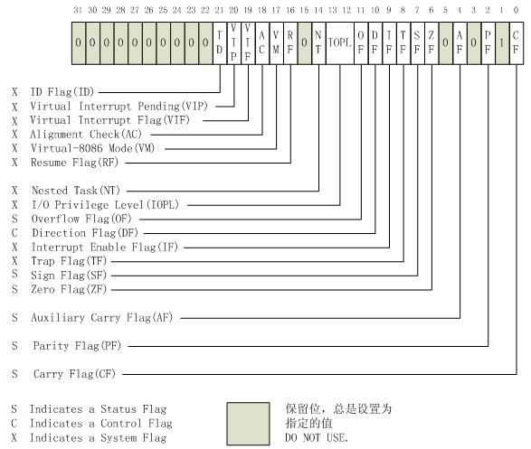

# 自旋锁

## 介绍

### 概念

是为实现保护共享资源而提出一种锁机制。其实，自旋锁与互斥锁比较类似，它们都是为了解决对某项资源的互斥使用。无论是互斥锁，还是自旋锁，在任何时刻，最多只能有一个保持者，也就说，在任何时刻最多只能有一个执行单元获得锁。但是两者在调度机制上略有不同。对于互斥锁，如果资源已经被占用，资源申请者只能进入睡眠状态。但是自旋锁不会引起调用者睡眠，如果自旋锁已经被别的执行单元保持，调用者就一直循环在那里看是否该自旋锁的保持者已经释放了锁，"自旋"一词就是因此而得名。

### 特点

* 自旋锁是忙等锁，当申请资源未释放时，当前进程不会睡眠而是不断循环查看自旋锁是否是否
* 被自旋锁保护的临界区代码执行时不能睡眠，不能被抢占，也不能被其他中断打断

## 死锁

自旋锁容易引发死锁问题

* 中断处理程序引发的死锁
  * 引发原因
    当某个进程申请占有了一个自旋锁，然后触发中断处理程序，该中断处理程序同样使用该自旋锁，导致中断处理无法结束，造成死锁
  * 解决方案
    在完成加锁操作前，关闭中断，使得在申请玩自旋锁后的操作中不会触发中断处理程序
* 同一CPU连续申请同一自旋锁造成的死锁
  * 引发原因
    当某一CPU申请占有一个自旋锁A后，在未释放锁A的情况下再次申请锁A，就会导致始终处在自旋状态，造成死锁
  * 解决方案
    在完成上锁操作前判断该CPU是否已申请过该锁，如有，则抛出panic异常
* 其他由于代码编写问题造成的死锁

## 结构

``` c
// Mutual exclusion lock.
struct spinlock {
  uint locked;       // Is the lock held?

  // For debugging:
  char *name;        // Name of lock.
  struct cpu *cpu;   // The cpu holding the lock.
  uint pcs[10];      // The call stack (an array of program counters)
                     // that locked the lock.
};
```

* 其中locked用于判断是否上锁
* 剩余部分用于debug，提供debug信息，包括以下信息
  * 锁的名字
  * 占有该锁的cpu
  * 函数调用栈

## 提供API

* initlock函数

  * 函数原型<pre> void initlock(struct spinlock *lk, char *name) </pre>
  * 初始化自旋锁，为自旋锁命名

* acquire函数

  * 函数原型<pre> void acquire(struct spinlock *lk)</pre>

  * 申请占有自旋锁lk

  * 函数解析

    ``` c
    // Acquire the lock.
    // Loops (spins) until the lock is acquired.
    // Holding a lock for a long time may cause
    // other CPUs to waste time spinning to acquire it.
    void
    acquire(struct spinlock *lk)
    {
      // 关闭中断
      pushcli(); // disable interrupts to avoid deadlock.
      // 如果锁lk已被当前cpu占有，抛出panic异常
      if(holding(lk))
        panic("acquire");
    
      // 进入自旋状态直到锁被释放
      // xchg函数是原子性操作，交换两个参数的值，并返回第一个参数的旧值
      // 当返回值为0时，代表锁已释放，并通过与1交换上锁
      // The xchg is atomic.
      while(xchg(&lk->locked, 1) != 0)
        ;
    
      // Tell the C compiler and the processor to not move loads or stores
      // past this point, to ensure that the critical section's memory
      // references happen after the lock is acquired.
      // 告知编译器避免对这段代码进行乱序优化，保证临界资源在上锁后访问
      __sync_synchronize();
    
      // 获取当前使用的cpu
      // Record info about lock acquisition for debugging.
      lk->cpu = mycpu();
      // 获取递归调用栈
      getcallerpcs(&lk, lk->pcs);
    }
    ```

* release函数

  * 函数原型<pre> void release(struct spinlock *lk)</pre>

  * 释放自旋锁

  * 函数解析

    ``` c
    // Release the lock.
    void
    release(struct spinlock *lk)
    {
      // 若锁已被释放，抛出panic异常
      if(!holding(lk))
        panic("release");
      // 清空占有锁的cpu及递归调用栈
      lk->pcs[0] = 0;
      lk->cpu = 0;
    
      // Tell the C compiler and the processor to not move loads or stores
      // past this point, to ensure that all the stores in the critical
      // section are visible to other cores before the lock is released.
      // Both the C compiler and the hardware may re-order loads and
      // stores; __sync_synchronize() tells them both not to.
      __sync_synchronize();
    
      // Release the lock, equivalent to lk->locked = 0.
      // This code can't use a C assignment, since it might
      // not be atomic. A real OS would use C atomics here.
      // 使用汇编保证解锁操作是原子的
      asm volatile("movl $0, %0" : "+m" (lk->locked) : );
      // 开启中断
      popcli();
    }
    ```

    

## 辅助函数

* pushcli和popcli函数

  * 函数原型  <pre>void pushcli(void)</pre> <pre> void popcli(void) </pre>
  * 用于代替cli，sti指令，封装了cli和sti指令
  * 保证了当pushcli指令和popcli指令一一对应且当前cpu为实现关闭中断的cpu时才进行sti操作，避免了在自旋锁还处在申请状态下打开中断
  * 对不恰当的调用顺序进行检测，并抛出异常

  ``` c
  // Pushcli/popcli are like cli/sti except that they are matched:
  // it takes two popcli to undo two pushcli.  Also, if interrupts
  // are off, then pushcli, popcli leaves them off.
  
  void
  pushcli(void)
  {
    int eflags;
  
    // 获取eflags
    eflags = readeflags();
    // 关闭中断，将eflags寄存器的IF位置0
    cli();
    if(mycpu()->ncli == 0)
      // 当第一次调用cli指令且IF位未置0时，对mycpu()->intena做上标记
      mycpu()->intena = eflags & FL_IF;
    // cli次数加1
    mycpu()->ncli += 1;
  }
  
  void
  popcli(void)
  {
    // 若中断已经开启，IF标志位为1，抛出panic异常
    if(readeflags()&FL_IF)
      panic("popcli - interruptible");
    // popcli操作次数大于pushcli次数，抛出panic异常
    if(--mycpu()->ncli < 0)
      panic("popcli");
    // 保证了当pushcli指令和popcli指令一一对应且当前cpu为实现关闭中断的cpu时才进行sti操作
    // 避免了在自旋锁还处在申请状态下打开中断
    if(mycpu()->ncli == 0 && mycpu()->intena)
      sti();
  }
  
  ```

* hoding函数

  * 函数原型 <pre> int holding(struct spinlock *lock)</pre>
  * 用于判断自旋锁lock是否被当前cpu占有

* getcallerpcs函数

  * 函数原型<pre> void getcallerpcs(void *v, uint pcs[])</pre>
  * 用于获取递归调用栈的信息，将其储存至pcs数组中
  * 函数解析

  ``` c
  void
  getcallerpcs(void *v, uint pcs[])
  {
    uint *ebp;
    int i;
    // 函数调用时栈指针结构
    // ebp栈底指针
    // esp栈顶指针
    // 本函数栈指针结构
    // 
    //      较早的栈
    // +12  参数pcs
    // +8   参数v
    // +4   返回地址
    // 0    旧的ebp
    //      当前函数使用的栈
    //      esp
    // 
    // 故地址v=epb+8byte
    // 又由于uint* 偏移一个单位即偏移8byte
    // 故 ebp = (uint*)v - 2;
    ebp = (uint*)v - 2;
    for(i = 0; i < 10; i++){
      if(ebp == 0 || ebp < (uint*)KERNBASE || ebp == (uint*)0xffffffff)
        break;
      // ebp[1]即为当前函数的返回地址
      // ebp[0]为返回的函数的ebp指针
      // 故使用该循环可以自底向上获取递归调用顺序
      pcs[i] = ebp[1];     // saved %eip
      ebp = (uint*)ebp[0]; // saved %ebp
    }
    // 剩余部分用0填充
    for(; i < 10; i++)
      pcs[i] = 0;
  }
  ```

  

## 附录

### xchg函数

* xchgl汇编指令是一个原子操作，用于置换两个操作数的值
* 两个操作数至少有一个是寄存器操作数
* 但xchgl不能保证在多核情况下也是原子性操作
* 故在执行xchgl前须使用lock汇编指令保证该指令在多核情况下也是原子操作

```  c
static inline uint
xchg(volatile uint *addr, uint newval)
{
  uint result;

  // The + in "+m" denotes a read-modify-write operand.
  // lock操作，保证xchgl在多核情况下是原子操作
  // 内联汇编输出参数
  // +m:内存操作数，可读写
  // =a, 寄存器操作数，将eax的值读入
  // 1:输入操作数，该操作数使用的寄存器与%1参数使用的寄存器一致
  asm volatile("lock; xchgl %0, %1" :
               "+m" (*addr), "=a" (result) :
               "1" (newval) :
               "cc");
  return result;
}
```

### EFLAGS寄存器




