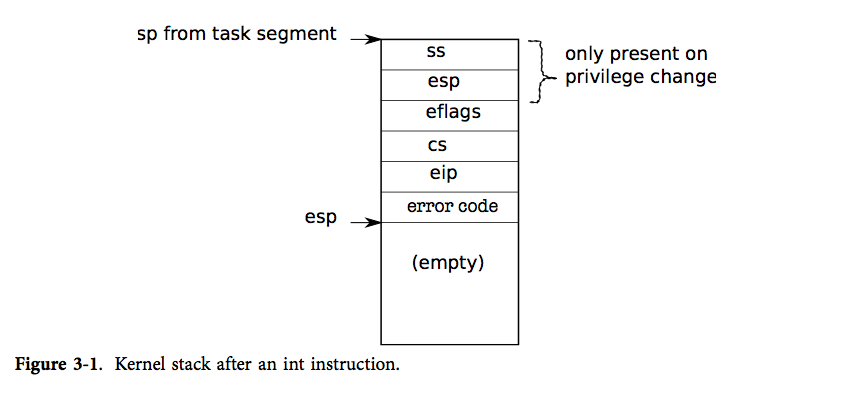

# 中断/异常机制

## 涉及文件

* vector.S
* trapasm.S
* trap.c

## 概念

中断（interrupts）和异常（Exception）是计算机系统，处理器，程序，任务运行时发生的“事件”（Event），代表发生了某些情况，此时处理器会强制从执行当前程序或任务转向执行中断处理程序（Interrupt Handler）和异常处理程序（Exception Handler）来对发生的事件进行处理。

中断发生在程序或任务运行的任意时间，用于回应硬件设备发出的信号（Signal），系统通过中断来处理外来事件，如对外围设备发出的请求。程序也可通过 INT n 指令主动产生中断请求调用中断处理程序。

异常指处理器在执行某些指令时发现错误，如除零错误，当发生异常时，和中断类似，处理器调用异常处理程序来对发生的异常进行处理

## 中断/异常处理流程

1. 处理器接收到中断信号或发现异常时，暂停当前运行的程序或任务并保存现场
2. 处理器根据中断或异常的类别调用相应的中断/异常处理程序
3. 中断/异常处理程序完成运行后，处理器恢复现场继续运行暂停的程序（除非异常导致程序不可恢复或中断导致程序终止）

## 异常分类

Intel将计算机发生的异常分为三类，陷阱（Trap），故障（Fault），中止（Abort）

### 陷阱

**陷阱**指在触发陷阱的指令运行后立刻报告的异常，它允许发生该异常的程序在不失连续性的情况下继续运行，该异常处理程序的返回地址是触发陷阱的指令的下一条指令

### 故障

**故障**是指可修复的异常，当发生故障时，允许程序以不失去连续性的方式重新启动，该异常处理程序的返回地址为触发故障的那一条指令

### 中止

**中止**是一种有时无法报告触发该异常确切位置的异常，该异常不允许程序在异常处理程序执行完毕后继续运行

## 系统调用

系统调用是操作系统提供给用户程序的一系列API，运行在内核态，完成一系列用户态无法执行的特权指令，如从硬盘读取文件等。

故当用户程序需要使用系统调用提供的功能时，则通过相应指令主动进入内核态，这个过程称为陷入（trap）

## x86体系的中断处理程序

由于异常，中断即系统调用的处理方式十分相似，x86架构对这些事件采用同样的硬件机制处理，为了简便起见，下面对这些事件都统称为中断。

x86提供了INT n指令来直接产生一个中断以便用户程序从用户态进入内核态调用中断处理程序。

### IDT

中断描述符表，最多有256项，每一个表项称为门描述符

用于将中断向量及门描述符联系起来

其中门描述符可分为中断门，陷阱门和任务门。

**门描述符格式**


### IRQ号映射到中断向量

IRQ指中断请求，即硬件向处理器发出，由中断控制器芯片控制

xv6使用APIC来完成中断控制，并且使用内存映射的方式对APIC进行访问，APIC默认地址为**0xFEC00000**，APIC为每个IRQ分配了一个寄存器来存放对应IRQ所对应的中断向量号

xv6使用如下代码完成IRQ号的映射

``` c
ioapicwrite(REG_TABLE+2*irq, T_IRQ0 + irq);
```

### INT n指令流程

- 从 IDT 中获得第 n 个描述符，n 就是 int 的参数。
- 检查 %cs 的域 CPL <= DPL，DPL 是描述符中记录的特权级。
- 如果目标段选择符的 PL < CPL，就在 CPU 内部的寄存器中保存 %esp 和 %ss 的值。
- 从一个任务段描述符中加载 %ss 和 %esp。
- 将 %ss 压栈。
- 将 %esp 压栈。
- 将 %eflags 压栈。
- 将 %cs 压栈。
- 将 %eip 压栈。
- 清除 %eflags 的一些位。
- 设置 %cs 和 %eip 为描述符中的值。




## xv6 中断/异常/系统调用机制

xv6对于所有中断处理程序都采取同样的措施，完成现场保存后均跳转至alltraps函数来实现相应的具体功能


### 中断向量表

* xv6使用脚本vector.pl完成中断向量表代码vector.S的生成

* 脚本生成的代码形如

  ``` assembly
  # sample output:
  #   # handlers
  #   .globl alltraps
  #   .globl vector0
  #   vector0:
  #     pushl $0
  #     pushl $0
  #     jmp alltraps
  #   ...
  #   
  #   # vector table
  #   .data
  #   .globl vectors
  #   vectors:
  #     .long vector0
  #     .long vector1
  #     .long vector2
  #   ...
  ```

* 每段代码先往栈内push errorcode（若非异常时，手动push以保证trapframe结构完整）和trapno参数

* 再调用alltraps函数

* vetors为建立的中断向量表，内容为每个中断处理函数入口地址

### alltraps和trapret函数

- 用于保存现场和恢复现场
- alltraps将通用寄存器存入栈中，构造出trapframe结构体，设置段选择子，再将栈顶指针esp作为指向结构体的指针参数存入栈中，调用trap函数
- 待trap函数执行完毕，再执行trapret，完成恢复现场的工作

### trap函数

* 根据参数选择执行相应的中断处理程序

* 函数解析

  ``` c
  void
  trap(struct trapframe *tf)
  {
    // 如果为中断类型为系统调用的话，调用相关系统调用
    if(tf->trapno == T_SYSCALL){
      if(myproc()->killed)
        exit();
      myproc()->tf = tf;
      syscall();
      if(myproc()->killed)
        exit();
      return;
    }
  
    
    switch(tf->trapno){
    // 触发计时器中断
    case T_IRQ0 + IRQ_TIMER:
      if(cpuid() == 0){
        acquire(&tickslock);
        // 计时器+1
        ticks++;
        // 唤醒相应进程
        wakeup(&ticks);
        release(&tickslock);
      }
      // 表示中断已接收
      lapiceoi();
      break;
    // 触发主从硬盘中断
    case T_IRQ0 + IRQ_IDE:
      ideintr();
      lapiceoi();
      break;
    case T_IRQ0 + IRQ_IDE+1:
      // Bochs generates spurious IDE1 interrupts.
      break;
    // 触发键盘中断
    case T_IRQ0 + IRQ_KBD:
      kbdintr();
      lapiceoi();
      break;
    // 触发串口设备中断
    case T_IRQ0 + IRQ_COM1:
      uartintr();
      lapiceoi();
      break;
  
    case T_IRQ0 + 7:
    case T_IRQ0 + IRQ_SPURIOUS:
      cprintf("cpu%d: spurious interrupt at %x:%x\n",
              cpuid(), tf->cs, tf->eip);
      lapiceoi();
      break;
  
    //PAGEBREAK: 13
    // 剩余中断则默认为异常触发的
    // 打印出异常信息完成异常处理，结束进程
    default:
      if(myproc() == 0 || (tf->cs&3) == 0){
        // In kernel, it must be our mistake.
        cprintf("unexpected trap %d from cpu %d eip %x (cr2=0x%x)\n",
                tf->trapno, cpuid(), tf->eip, rcr2());
        panic("trap");
      }
      // In user space, assume process misbehaved.
      cprintf("pid %d %s: trap %d err %d on cpu %d "
              "eip 0x%x addr 0x%x--kill proc\n",
              myproc()->pid, myproc()->name, tf->trapno,
              tf->err, cpuid(), tf->eip, rcr2());
      myproc()->killed = 1;
    }
  
    // Force process exit if it has been killed and is in user space.
    // (If it is still executing in the kernel, let it keep running
    // until it gets to the regular system call return.)
    // 若进程状态为killed且处于用户态，结束进程
    if(myproc() && myproc()->killed && (tf->cs&3) == DPL_USER)
      exit();
  
    // Force process to give up CPU on clock tick.
    // If interrupts were on while locks held, would need to check nlock.
    // 当中断为计时器中断时，进行调度
    if(myproc() && myproc()->state == RUNNING &&
       tf->trapno == T_IRQ0+IRQ_TIMER)
      yield();
  
    // Check if the process has been killed since we yielded
    if(myproc() && myproc()->killed && (tf->cs&3) == DPL_USER)
      exit();
  }
  ```

  


